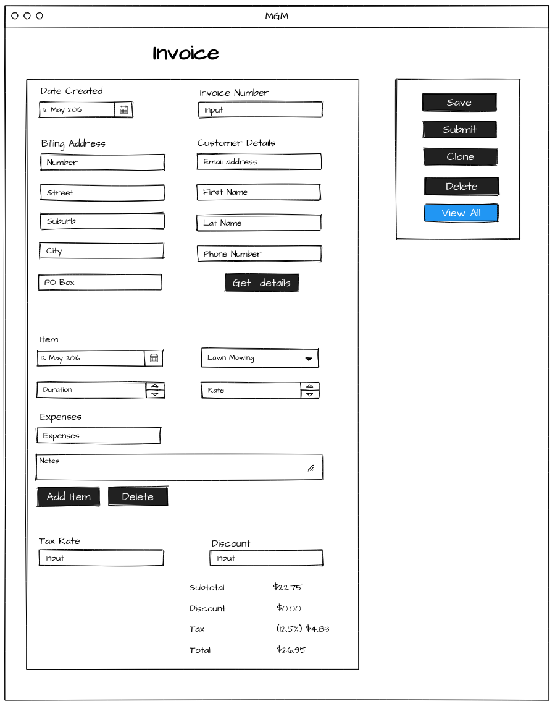
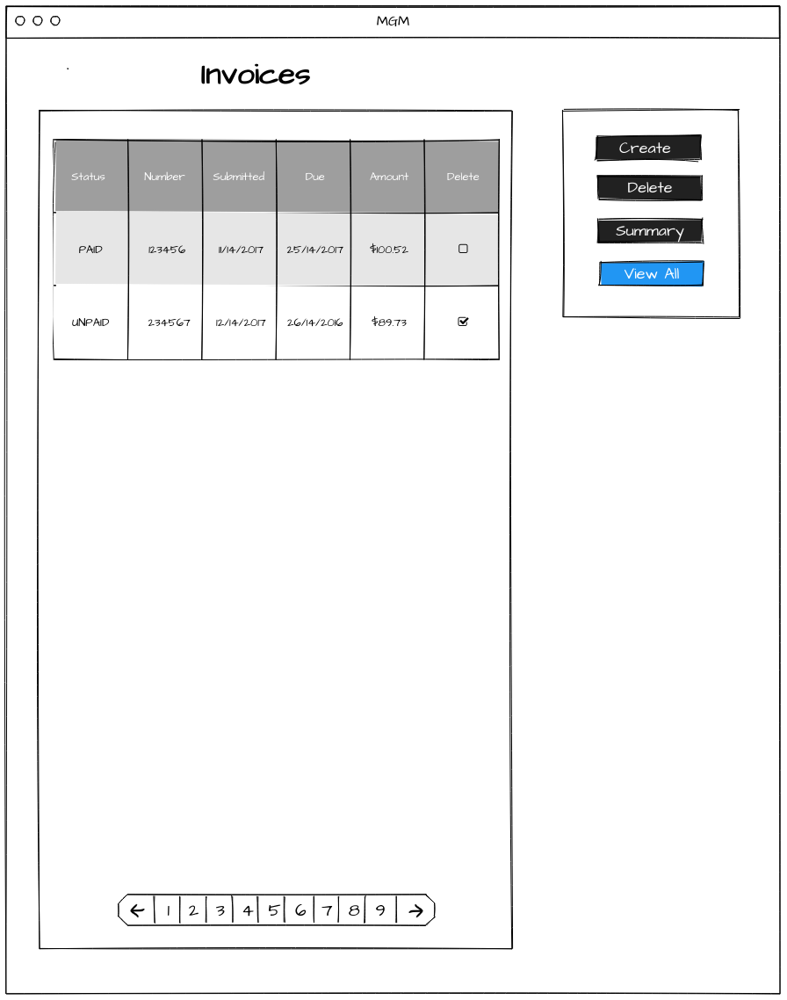
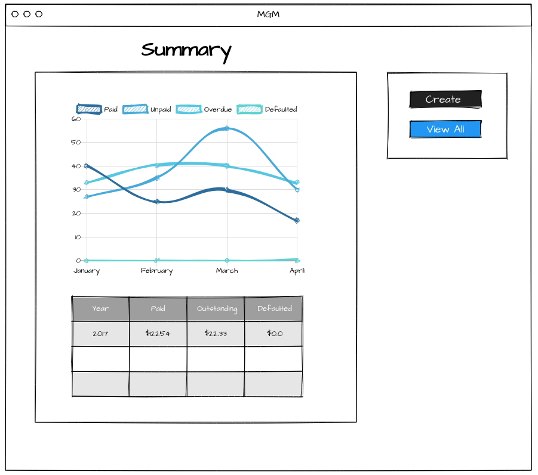

<!-- Heading start-->
<h1 align="center"> feature/invoice </h1>  

    <picture>
        
    </picture>

  Create and manage invoices

<picture>
	
</picture>
<picture>
	
</picture>
<picture>
	
</picture>

<!-- Heading end-->
 

### Backlog

- [ ] Page to create an invoice
- [ ] Page to view all invoices
- [ ] Page to summarise invoices
- [ ] Email invoice to customer
- [ ] Email contact forms to user

## Wireframes

### `Create invoice`

  

### `View all invoices`

  

### `Summary`

  
